### 机打票据识别历程:airplane:

> 本仓库主要记录自己在开发设计机打票据自动识别处理业务当中所遇到的一些坎坷和解决办法，以及一些对相似业务有指引意义的文章或仓库链接，总体来说，自己从这次项目当中学习巩固了不少知识，包括后台业务的处理开发，基于传统形态学处理的图像处理方式，Web后台开发应该有的思考设计方式，blabla.... 总之就是成长了不少嘛​,由于项目总结的不是很及时，所以其中可能有些疏漏，但思考方向和经验是不会错的:wink:

### 缘起

所在工作地是一家主打会计报账的人工智能初创公司，其中一个需求便是针对机打票据进行自动识别并形成结构化数据入库。为何不去对接开票接口呢？理由有三，其一，一般开票机构不会开放此接口，特别对于外部访问，这是属于敏感数据，不可能随便开放接口；其二，票据来源、种类多种多样，每一种票据基本都会有专门的处理系统；其三，每个公司的票据都是管理成册的，特别是针对增值税普票和专票，如果票据缺失，将会直接影响月底的结账平衡，当然，这主要是会计所关心的问题了，我们所关心的无非是“票据完整”这个特性。

针对以上这些特性，留给我们技术的工作就是将这些公司扎帐需要的票据进行集中化的管理存储和信息提取。

一图胜千言(下面就是一张增值税专用发票，并且是处理过的，初始扫描的图像并没有如此规整，侵删)：

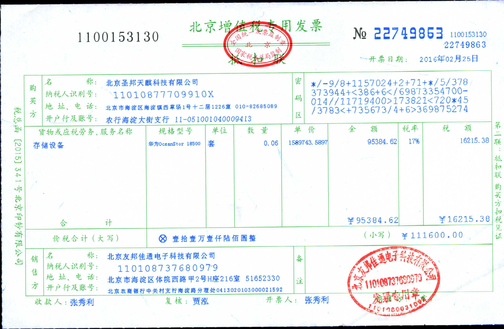

我们需要做的就是将这上面的感兴趣字段（ROI）进行识别并结构化入库。

### 识别影响因素

- 票据种类很多，首先需要明确要操作的是哪一种票据，好定制对应的识别操作模板
- 有些扫描的图样并不规整，需要纠偏操作
- 图像透视操作以后会有形状损失
- 票据版面上有很多墨迹干扰，需要DeBlur
- 票据版面上的感兴趣区域难以定位，因为前期处理后，ROI位置会随之变动，难以以规则直接限制
- 印章区域如何识别
- 不能程序处理的图像应该如何处理

- .......

### 思考

> 在综合考虑权衡以上因素以后，我们才能够开始我们的开发工作，下面简要梳理以下我的思考流程

- 先从业务上进行考虑，这个业务一定要做吗（废话，不做能行吗:wink:）,其实意思是有没有从业务上规避的处理方式，万一哪天发现条件变了，不用做了或者重新换个方式再做，这不是自己找不愉快吗:blush:
- 再从技术可行性上进行考虑，自己有这方面的基础吗（废话，创造条件也要上！:expressionless:），有前人类似的开发经验供参考吗（诸多开源项目可供参考使用），有扩展性需求吗，公司给的服务器配置是否满足需求。blabla

### 我的实现流程

> 这里简单简单展示一下我的各个阶段处理结果

#### 图像分类

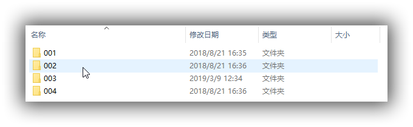

可以看看分类3文件夹中的图样文件信息：

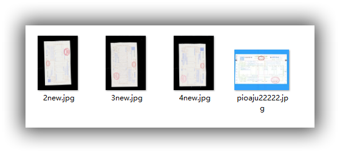

### 图像标志特征标记

这里仍以增值税票据为例，增值税有一个明显的特征，就是左上角有一个二维码，这个二维码仅标识一些基本的信息，但它可以作为图片定位的特征

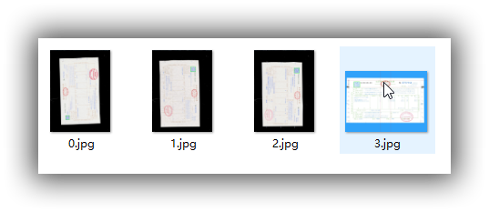

这么看估计看不太清，实际是在每张图片中标记出了二维码的位置，具体的标记方法可以看我的[博文](http://augustrush.me/post/Qrcode-detection-and-recognition.html)

### 图像旋转操作

图像的标志定位需要一定的位置作为基础，所以需要进行一些旋转操作

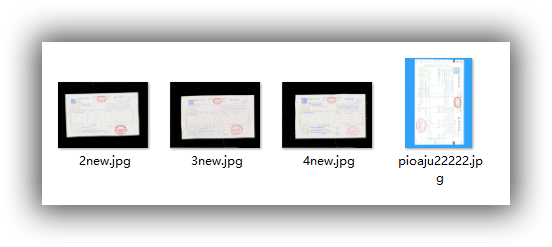

### 图像校正纠偏操作

以上处理之后图像的一些分离特征就变得非常好辨识了，可以进一步对票据进行纠偏处理了

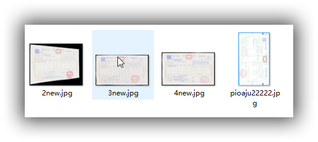

### 进一步纠偏处理

其实此步并不是必要的，只是之前有一张图片我对它进行了处理，导致它有两个外轮廓，这里不妨再进行一次纠偏处理就行


### 图像DeBlur

前述步骤处理后的图样依旧会有一些形变模糊什么的，到了这一步就可控多了，因为削弱了前面的很多影响因素。

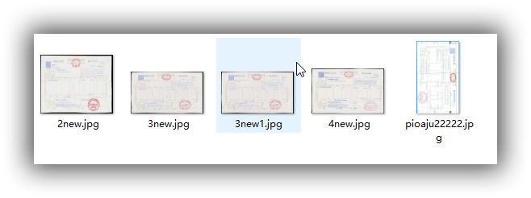

### 文字识别（OCR）

这个我尝试了使用开源的`tessract`进行识别处理，但效果并不是很好，还得进行字模训练，但考虑到公司暂时并不打算这么做，所以直接调用的百度的API进行的文字识别，如果对文字识别感兴趣的可以参考这个[博主](https://www.cnblogs.com/skyfsm/)的文章，Very Nice！

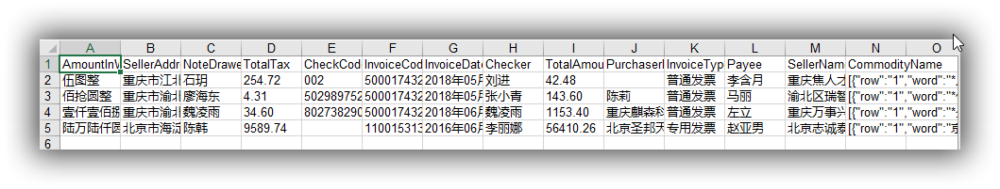


### 不完全运行指南和关键代码说明:wink:

因为代码涉及到公司隐私，故不完全开源，这是一个初步版本的代码，对应`MyPro`文件夹，希望能够提供给做类似业务的童鞋一个小小的参考思路，谢谢大家看到这里不打我！真爱啊！:blush:

#### 发票识别模块说明

> 记录发票信息处理的整体处理流程
>
> 全部按照批量运行的方式编写，将待识别发票放置于指定目录下即可，暂时仅支持增值税发票
>
> 程序异构，并且需要加载大权重文件，运行时可能会出现假死情况，但仍在运行，注意程序的控制台输出信息，也可将控制台输出部分改写为输出至log文件当中，便于组件化运行

#### 代码运行环境配置

- Java开发环境（配置环境变量）
- python开发环境（安装anaconda即可完成很多基础包的安装配置）（配置环境变量）
- 安装其他依赖包，包括tensorflow、keras、opencv

#### 三方接口依赖配置

百度接口接入许可，`APPID+apiKey+secretKey `,上百度接口服务平台申请基本文字识别许可，并创建工单，申请专用发票识别接口（注意专用发票识别接口区别于通用文字识别接口，需要提工单申请开放）

### 工程描述

程序总体分为两部分

- 图像预处理部分，使图片达到可识别的要求
- 调用百度AI文字识别专用接口，批量传送图片并获得Json结构化数据，存储至excel表格中

#### 程序入口

- 图片处理部分入口（一个图片处理综合调配类）——ControlCenter

> business\recognition\BaiDuApi\java-sdk\src\main\java\com\Integrate\Test\ControlCenter.java

- 批量读取上面处理完的图片并请求接口——BatchReadAndRecognize.java

> src\main\java\com\ggq\VatInvoiceRcognize\BatchReadAndRecognize.java

#### 输入分类图片

暂时绝对路径处理：（以下为输入图片路径，直接在controlcenter.java文件中修改即可）

> E:\business\recognition\InvoiceClassification\Keras-image-classifer-framework\invoice-code\testBatchRead

#### 关键输出文件夹

- 图片达到可识别的地步存放文件夹——business\recognition\BaiDuApi\final\003
- 百度文字识别后结构化输出数据——business\recognition\BaiDuApi\ExcelResult\003

#### 批量获取某目录下的所有图片的图片名

```java
/**
 * @author AUGUSTRUSH
 *批量获取某目录下的所有图片的图片名
 *传入参数：图片所在目录
 *返回参数：图片名列表
 *要求：图片以.jpg结尾
 */
public class GetImageNameClass {
	public List<String> getImageName(String imgDir){
		List<String> imgNameList=new ArrayList<String>();
		File dir=new File(imgDir);
		File[] files = dir.listFiles(new FilenameFilter() {
			//获取.jpg文件时使用listFiles(FilenameFilter filter)方法，创建一个过滤文件名的Filter
			    @Override
			    public boolean accept(File dir, String name) {
			        if(name != null) {
			        //检测文件名是否是以.jpg结尾，是返回true，否则继续检测下一个文件
			            if(name.toLowerCase().endsWith(".jpg")) {
			                return true;
			            }
			        }
			        return false;
			    }
			});
		for(File file:files) {
			imgNameList.add(file.getName());
		}
		return imgNameList;
	}
}

```

#### 调用python文件对指定图片进行第一次矫正处理

```java
public class ImageAdjust {
	public void imgAdjustTool(String imgDir,String outputDir) {
		Process proc;
		String pythonFile="E:/business/recognition/BaiDuApi/pythonScript/OpenCV-Document-Scanner/scan.py";
		try {
			String[] args = new String[] { "python", pythonFile,String.valueOf(imgDir),String.valueOf(outputDir)};
			proc = Runtime.getRuntime().exec(args);// 执行py文件
			//用输入输出流来截取结果
			BufferedReader in = new BufferedReader(new InputStreamReader(proc.getInputStream()));
			String line = null;
			while ((line = in.readLine()) != null) {
            	System.out.println(line);
            }
            in.close();
            proc.waitFor();
		}
		catch (IOException e) {
			e.printStackTrace();
		}
		catch (InterruptedException e) {
			e.printStackTrace();
		}
		
		System.out.println("Image Adjust Done！");
	}
}

```

#### 批量获取图片的分类信息

```java
/**
 * @author AUGUSTRUSH
 *批量获取图片的分类信息
 *传入参数：图片所在目录
 *返回参数：图片的分类列表
 *要求：图片以.jpg为后缀
 */
public class GetTheCategoryClass {
	public List<String> getCategory(String imgDir) {
		BatchImageClassification classifier=new BatchImageClassification();
		StringBuffer stringBuffer=classifier.getImageCategory(imgDir);
		String string=new String(stringBuffer);
		String[] lines=string.split("\\n");
		List<String> imgNameList=new ArrayList<String>();//有序存放图片文件名
		List<String> imgCategoryList=new ArrayList<String>();//有序存放图片类别信息
		for (String line : lines) {
			String string2=line.substring(line.length()-4,line.length());
			if(string2.equalsIgnoreCase(".jpg")) {
				//System.out.println("the picture name is: "+line);
				imgNameList.add(line);
			}
			else{
				StringBuffer sb=new StringBuffer(line);
				RegularExpressionUtil regularExpressionUtil=new RegularExpressionUtil();
				List<String> list=regularExpressionUtil.REparseUtil(sb);
				String category=list.get(0);
				imgCategoryList.add(category);
			}
        }
		return imgCategoryList;
	}
}

```

#### 批量检测图片分类

```java
/**
 * @author AUGUSTRUSH
 *批量检测图片分类测试类
 *对应调用predict1_new.py
 *传入参数：图片所在目录
 *返回参数：图片名+分类
 *
 */
public class BatchImageClassification {
	public StringBuffer getImageCategory(String imgDir) {
		Process proc;
		StringBuffer buf = new StringBuffer();
		String pythonFile="E:/business/recognition/BaiDuApi/pythonScript/InvoiceClassification/Keras-image-classifer-framework/invoice-code/predict1_new.py";
		try {
			String[] args = new String[] { "python", pythonFile,String.valueOf(imgDir)};
			proc = Runtime.getRuntime().exec(args);// 执行py文件
			//用输入输出流来截取结果
			BufferedReader in = new BufferedReader(new InputStreamReader(proc.getInputStream()));
			String line = null;
			while ((line = in.readLine()) != null) {
            	System.out.println(line);
            	buf.append(line+"\n");
            }
            in.close();
            proc.waitFor();
		}
		catch (IOException e) {
			e.printStackTrace();
		}
		catch (InterruptedException e) {
			e.printStackTrace();
		}
		return buf;
	}
}
```

#### 按照分类信息批量分别存储至指定目录

```java
/**
 * @author AUGUSTRUSH
 *此类将筛选出来的图片转存到一个专门的文件夹存放
 *传入参数：文件目录名+文件名列表+需要转存的文件索引
 */
public class BatchSaveImages {
	public void saveImages(DirectoryEnum destDir,String imgDir,List<String> imgNameList,List<Integer> imgIndex) throws IOException {
		for(int i=0;i<imgIndex.size();i++) {
			String imaName=imgNameList.get(imgIndex.get(i));
			String absoluteImgName=imgDir+"/"+imaName;
			File file=new File(absoluteImgName);
			FileInputStream fis = new FileInputStream(file);
			FileOutputStream fos = new FileOutputStream(new File(destDir + "/" + imaName));
			byte[] read = new byte[1024];
            int len = 0;
            while((len = fis.read(read))!= -1){
                fos.write(read,0,len);
            }
            fis.close();
            fos.flush();
            fos.close();
		}
	}
}

```

#### 决定图片旋转方向

```java
/**
 * @author AUGUSTRUSH
 * 批量
 *此类封装较多，功能是决定给定的一张图像朝顺时针旋转90度还是逆时针旋转90度
 *扫描的图基本就是纵向的图片，需要根据二维码的位置决定怎么旋转
 *二维码要么在左下角，要么在右上角
 *传入参数：图片所在目录
 *返回参数：flags(false：顺时针90度，true：逆时针90度)
 */
public class WhichDirectionToRotateBatch {
	public List<Boolean> DecideDirection(DirectoryEnum imgDir) {
		String imgDirTransform=imgDir.toString();
		QrCodeBatchDetect qrCodeBatchDetect=new QrCodeBatchDetect();
		StringBuffer stringBuffer= qrCodeBatchDetect.getCoordinates(imgDirTransform);
		CoordinatesParseUtil cp=new CoordinatesParseUtil();
		String coordinates=stringBuffer.toString();
		//System.out.println(coordinates);
		String[] coordinates1=coordinates.split("\\+");
		List<Integer> imageWidthList=new ArrayList<Integer>();//装所有图片宽度
		List<Float> averageXList=new ArrayList<Float>();//装二维码横坐标的平均值
		List<Boolean> rotateDirection=new ArrayList<Boolean>();//装旋转方向标志
		//System.out.println(coordinates1.length);
		for(int i=0;i<coordinates1.length;i++) {
			StringBuffer temp=new StringBuffer(coordinates1[i]);
			List<String> list=cp.rotateDirection(temp);
			if(list.size()==3) {
				int imageWidth=Integer.parseInt(list.get(1));
				imageWidthList.add(imageWidth);
			}
			else {
				int firstPointX=Integer.parseInt(list.get(0));
				int thirdPointX=Integer.parseInt(list.get(4));
				float averageX=(firstPointX+thirdPointX)/2;
				averageXList.add(averageX);
			}
		}
		for(int j=0;j<imageWidthList.size();j++) {
			rotateDirection.add(averageXList.get(j)<(imageWidthList.get(j))/2?false:true);
		}
		
		return rotateDirection;

		
	}

}

```

#### 完成图片的旋转操作

```java
/**
 * @author AUGUSTRUSH
 * 此类完成图像的旋转操作，是一个基本的工具类
 * 批量操作
 * 0标志表示顺时针旋转90度
 * 1标志表示逆时针旋转90度
 * 传入参数：图片所在路径
 * 返回参数：控制台输出"rotate done！"
 */
public class ImageRotateUtil {
	public void rotate(String inImgDir,String outImgDir,int[] rotateDirection) throws IOException {
		File file=new File(inImgDir);
		File[] files=file.listFiles();
		int i=0;
		for(File file2:files) {
			if(!file2.isDirectory()) {
				String outputPath=outImgDir+"/"+files[i].getName();
				System.out.println(outputPath);
				BufferedImage image=ImageIO.read(file2);
				File outFile = new File(outputPath);
				System.out.println(rotateDirection[i]);
				switch (rotateDirection[i]) {
				case 0://顺时针旋转
					image=Rotate(image, 90);
					ImageIO.write(image,"jpg",outFile);
					i++;
					break;
				case 1://逆时针旋转
					image=Rotate(image, 270);
					ImageIO.write(image,"jpg",outFile);
					i++;
					break;
				default:
					break;
				}
			}
		}
		System.out.println("rotate done!");
	}
	/**
     * 对图片进行旋转
     *
     * @param src   被旋转图片
     * @param angel 旋转角度
     * @return 旋转后的图片
     */
    public static BufferedImage Rotate(Image src, int angel) {
        int src_width = src.getWidth(null);
        int src_height = src.getHeight(null);
        // 计算旋转后图片的尺寸
        Rectangle rect_des = CalcRotatedSize(new Rectangle(new Dimension(
                src_width, src_height)), angel);
        BufferedImage res = null;
        res = new BufferedImage(rect_des.width, rect_des.height,
                BufferedImage.TYPE_INT_RGB);
        Graphics2D g2 = res.createGraphics();
        // 进行转换
        g2.translate((rect_des.width - src_width) / 2,
                (rect_des.height - src_height) / 2);
        g2.rotate(Math.toRadians(angel), src_width / 2, src_height / 2);
 
        g2.drawImage(src, null, null);
        return res;
    }
	
    /**
     * 计算旋转后的图片
     *
     * @param src   被旋转的图片
     * @param angel 旋转角度
     * @return 旋转后的图片
     */
    public static Rectangle CalcRotatedSize(Rectangle src, int angel) {
        // 如果旋转的角度大于90度做相应的转换
        if (angel >= 90) {
            if (angel / 90 % 2 == 1) {
                int temp = src.height;
                src.height = src.width;
                src.width = temp;
            }
            angel = angel % 90;
        }
 
        double r = Math.sqrt(src.height * src.height + src.width * src.width) / 2;
        double len = 2 * Math.sin(Math.toRadians(angel) / 2) * r;
        double angel_alpha = (Math.PI - Math.toRadians(angel)) / 2;
        double angel_dalta_width = Math.atan((double) src.height / src.width);
        double angel_dalta_height = Math.atan((double) src.width / src.height);
 
        int len_dalta_width = (int) (len * Math.cos(Math.PI - angel_alpha
                - angel_dalta_width));
        int len_dalta_height = (int) (len * Math.cos(Math.PI - angel_alpha
                - angel_dalta_height));
        int des_width = src.width + len_dalta_width * 2;
        int des_height = src.height + len_dalta_height * 2;
        return new Rectangle(new Dimension(des_width, des_height));
    }
}

```

#### 再次完成图片的矫正操作

```java
String adjustDir="E:/business/recognition/BaiDuApi/imgAdjusted/003";
		imageAdjust.imgAdjustTool(out,adjustDir);
		String basicCompletedDir="E:/business/recognition/BaiDuApi/imageBasicCompleted/003";
		imageAdjust.imgAdjustTool(adjustDir, basicCompletedDir);
```

#### 完成图片的锐化操作

> 尝试使用pix2pix模型完成超分辨率的问题，但是效果并不明显，直接插值操作似乎更好

```java
/**
 * @author AUGUSTRUSH
 * 此类批量完成图片锐化操作并保存
 */
public class BatchImageSharp {
	static {
        System.loadLibrary(Core.NATIVE_LIBRARY_NAME);
    }
	private String fullName;
	public void BatchSharpImg(String imgDir,String outputDir) {
		List<String> imgNameList=getImageName(imgDir);
		for(int i=0;i<imgNameList.size();i++) {
			fullName=imgDir+"/"+imgNameList.get(i);
			Mat imread = Imgcodecs.imread(fullName);
			Mat sharpResult=ImageSharpUtil.sharpen(imread, 5, 2);
			String outputFilename=outputDir+"/"+imgNameList.get(i);
			Imgcodecs.imwrite(outputFilename, sharpResult);
		}
		System.out.println("Image Sharpen Done!");
	}
	
	/**
	 * 获取指定目录下的文件名列表（仅包括文件名）
	 * @param imgDir
	 * @return
	 */
	public List<String> getImageName(String imgDir){
		List<String> imgNameList=new ArrayList<String>();
		File dir=new File(imgDir);
		File[] files = dir.listFiles(new FilenameFilter() {
			//获取.jpg文件时使用listFiles(FilenameFilter filter)方法，创建一个过滤文件名的Filter
			    @Override
			    public boolean accept(File dir, String name) {
			        if(name != null) {
			        //检测文件名是否是以.jpg结尾，是返回true，否则继续检测下一个文件
			            if(name.toLowerCase().endsWith(".jpg")) {
			                return true;
			            }
			        }
			        return false;
			    }
			});
		for(File file:files) {
			imgNameList.add(file.getName());
		}
		return imgNameList;
	}
	
}

```

#### 图片文字提取识别

```java
package com.ggq.VatInvoiceRcognize;

import java.io.ByteArrayOutputStream;
import java.io.File;
import java.io.FileNotFoundException;
import java.io.FilenameFilter;
import java.io.IOException;
import java.util.ArrayList;
import java.util.Iterator;
import java.util.List;

import javax.imageio.stream.FileImageInputStream;

import org.json.JSONObject;

import com.Integrate.Test.DirectoryEnum;
import com.baidu.aip.ocr.AipOcr;
enum keywords{AmountInWords,SellerAddress,NoteDrawer,TotalTax,CheckCode,InvoiceCode,InvoiceDate,
	Checker,TotalAmount,PurchaserName,InvoiceType,Payee,SellerName,CommodityName};
public class BatchReadAndRecognize {

	public static void main(String[] args) throws IOException {
		AipOcr aipOcr=new AipOcr("10728591", "k1qEDIj16cfpEQU1FUGYEXIG", "NGZqqvWlaoS8Ydqfz0EtLYKu7ebkiQMW");
		String VatVoicePictureDir=DirectoryEnum.finalVatInvoicePic.toString();
		//System.out.println(VatVoicePictureDir);
		File folders = new File(VatVoicePictureDir);//classPath为文件路径 
		File[] files = folders.listFiles(new FilenameFilter() {
			//获取.jpg文件时使用listFiles(FilenameFilter filter)方法，创建一个过滤文件名的Filter
			    @Override
			    public boolean accept(File dir, String name) {
			        if(name != null) {
			        //检测文件名是否是以.jpg结尾，是返回true，否则继续检测下一个文件
			            if(name.toLowerCase().endsWith(".jpg")) {
			                return true;
			            }
			        }
			        return false;
			    }
			});
		for(File file:files) {
			System.out.println(file);
		}
		List<String> pictureName=pictureNameTransform(files);
		List<VatDataBean> VatBeanList=new ArrayList<VatDataBean>();
		for(int i=0;i<pictureName.size();i++) {
			System.out.println(pictureName.get(i));
			byte[] image=null;
			JSONObject jsonObject=new JSONObject();
			image=image2byte(pictureName.get(i));
			jsonObject=aipOcr.vatInvoice(image, null);
			JSONObject jsonObject2=jsonObject.getJSONObject("words_result");
			Iterator it = jsonObject2.keys();
			VatDataBean vatDataBean=new VatDataBean();
			while(it.hasNext()){
				String key=(String)it.next();
				Object value=jsonObject2.get(key.toString());
				//System.out.println(key+": "+value);
				if(key.equals("AmountInWords")) {
					String AmountInWordsValue=value.toString();
					vatDataBean.setAmountInWords(AmountInWordsValue);
				}else if(key.equals("SellerAddress")) {
					String SellerAddressValue=value.toString();
					vatDataBean.setSellerAddress(SellerAddressValue);
				}else if (key.equals("NoteDrawer")) {
					String NoteDrawerValue=value.toString();
					vatDataBean.setNoteDrawer(NoteDrawerValue);
				}else if (key.equals("TotalTax")) {
					String TotalTaxValue=value.toString();
					vatDataBean.setTotalTax(TotalTaxValue);
				}else if (key.equals("CheckCode")) {
					String CheckCodeValue=value.toString();
					vatDataBean.setCheckCode(CheckCodeValue);
				}else if (key.equals("InvoiceCode")) {
					String InvoiceCodeValue=value.toString();
					vatDataBean.setInvoiceCode(InvoiceCodeValue);
				}else if (key.equals("InvoiceDate")) {
					String InvoiceDateValue=value.toString();
					vatDataBean.setInvoiceDate(InvoiceDateValue);
				}else if (key.equals("Checker")) {
					String CheckerValue=value.toString();
					vatDataBean.setChecker(CheckerValue);
				}else if (key.equals("TotalAmount")) {
					String TotalAmountValue=value.toString();
					vatDataBean.setTotalAmount(TotalAmountValue);
				}else if (key.equals("PurchaserName")) {
					String PurchaserNameValue=value.toString();
					vatDataBean.setPurchaserName(PurchaserNameValue);
				}else if (key.equals("InvoiceType")) {
					String InvoiceTypeValue=value.toString();
					vatDataBean.setInvoiceType(InvoiceTypeValue);
				}else if (key.equals("Payee")) {
					String PayeeValue=value.toString();
					vatDataBean.setPayee(PayeeValue);
				}else if (key.equals("SellerName")) {
					String SellerNameValue=value.toString();
					vatDataBean.setSellerName(SellerNameValue);
				}else if (key.equals("CommodityName")) {
					String CommodityNameValue=value.toString();
					vatDataBean.setCommodityName(CommodityNameValue);
				}
				
				
			}
			VatBeanList.add(vatDataBean);
			System.out.println(vatDataBean);
			
		}
		String FilePath="E:/business/recognition/BaiDuApi/ExcelResult/003/VatInvoice.xlsx";
		String[] excelTitle= {"AmountInWords","SellerAddress","NoteDrawer",
				"TotalTax","CheckCode","InvoiceCode","InvoiceDate","Checker","TotalAmount",
				"PurchaserName","InvoiceType","Payee","SellerName","CommodityName"};
		String sheetName="003";
		WriteToExcel writeToExcel=new WriteToExcel();
		writeToExcel.writetoExcel(FilePath, excelTitle, VatBeanList, sheetName);
		System.out.println("All done!");
	}
	
	public static List<String> pictureNameTransform(File[] files){
		List<String> absolutePictureName=new ArrayList<String>();
		for(File file:files) {
			absolutePictureName.add(file.toString().replace("\\", "/"));
		}
		return absolutePictureName;
	}
	
	
	//图像转byte数组
	public static byte[] image2byte(String path){
		 byte[] data = null;
		 FileImageInputStream input = null;
		 try {
			 //图片输入
			 input = new FileImageInputStream(new File(path));
			 ByteArrayOutputStream output = new ByteArrayOutputStream();
			 byte[] buf = new byte[1024];
			 int numBytesRead = 0;
			 while ((numBytesRead = input.read(buf)) != -1) {
			      output.write(buf, 0, numBytesRead);
			      }
			      data = output.toByteArray();
			      output.close();
			      input.close();
			  
		}  catch (FileNotFoundException ex1) {
		      ex1.printStackTrace();
	    }
	    catch (IOException ex1) {
	      ex1.printStackTrace();
	    }
		return data;
	}

}

```

### 参考文章或仓库

1. 验证码识别程序+验证码自动识别工具类+发票标号识别案例

这个博主主要阐述了验证码的自动识别思路，这对于爬虫的自动登录是有很大借鉴意义的，我在之后的一个自动报税任务当中就参考了这个思路，[地址](http://www.cnblogs.com/cnduan/p/5154419.html),来两张图片粗略感受一下：

待识别验证码：

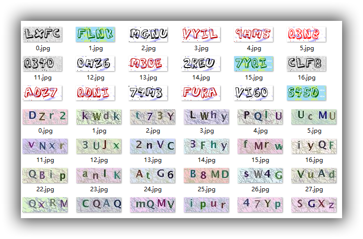

可视化处理步骤：

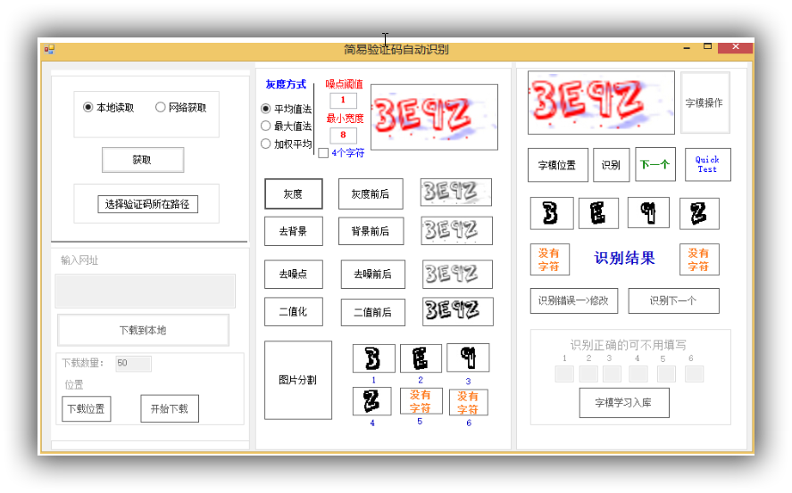

识别准确率：

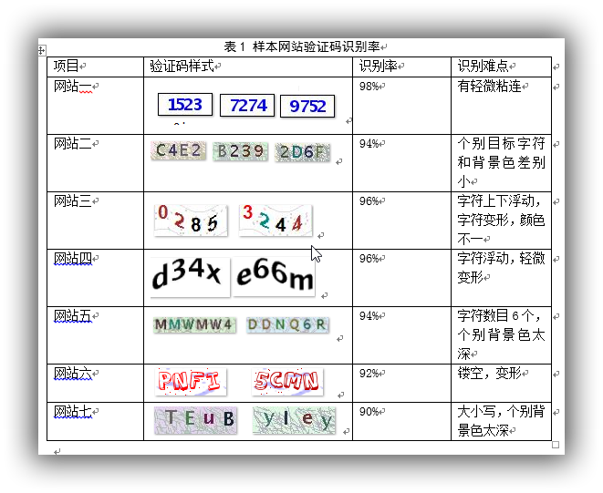

2. [**OpenCV-Python-Tutorial**](https://github.com/AUGUSTRUSH8/OpenCV-Python-Tutorial):beers: awesome！！！

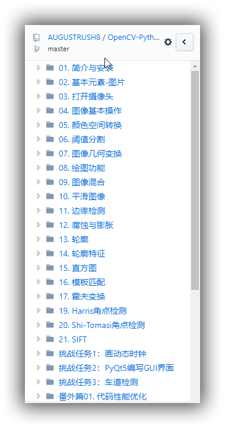

3. [Java_OCR](http://blog.csdn.net/top_code/article/details/39667299) tess4j_图片文字识别。

4. [**OpenCV-Document-Scanner**](https://github.com/andrewdcampbell/OpenCV-Document-Scanner)一款仿有道云笔记扫描功能的APP
5. [YOLOv3](https://github.com/xiaochus/YOLOv3)

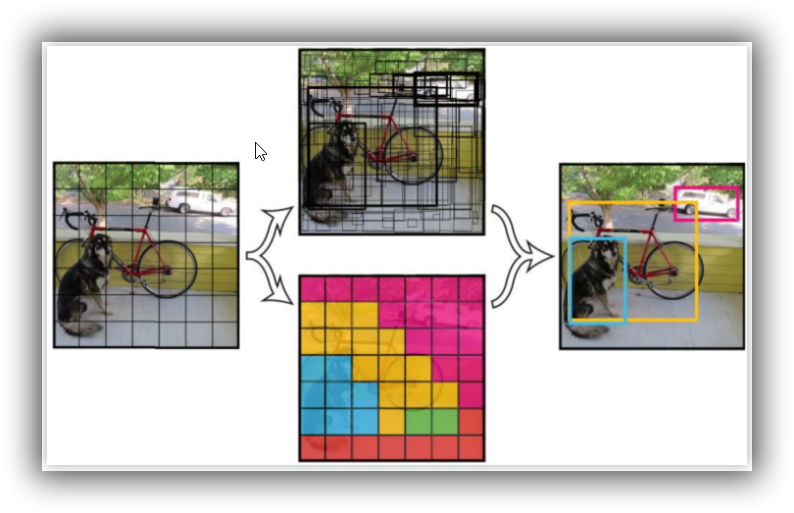

6. 其他还有很多图片轻量级操作工具博文什么的，在此就不一一列举了

## 公众号


